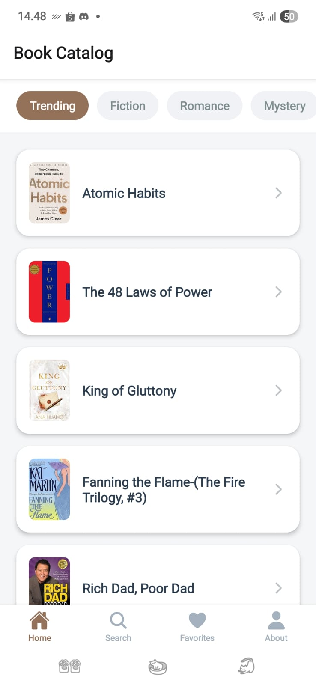
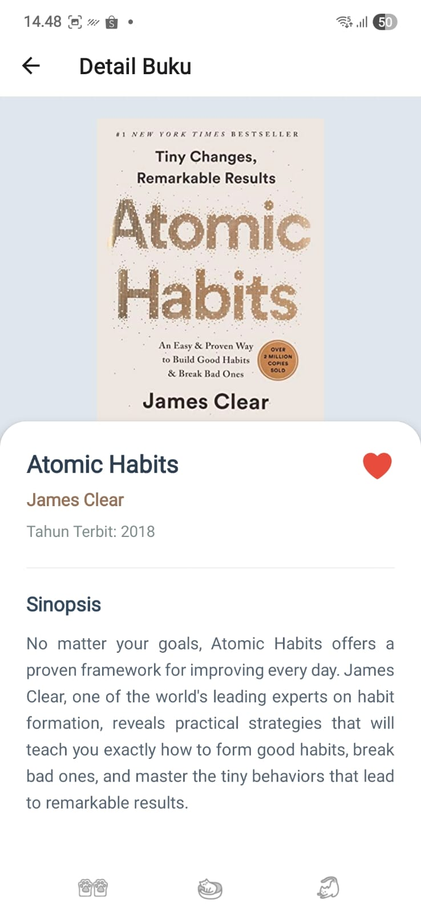
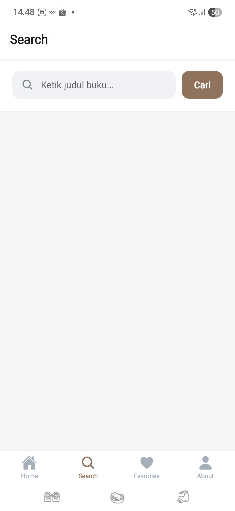
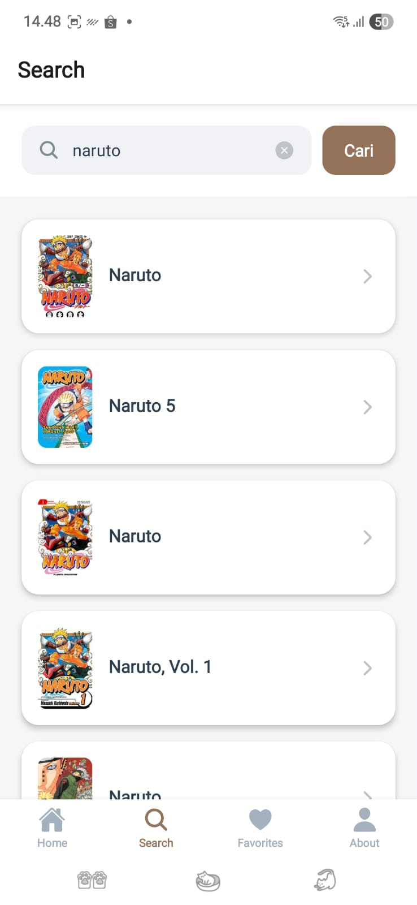
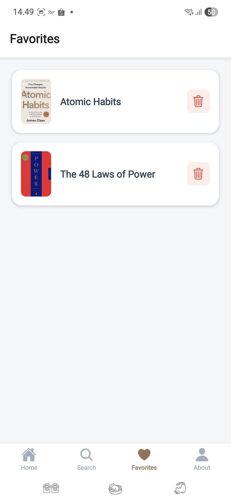
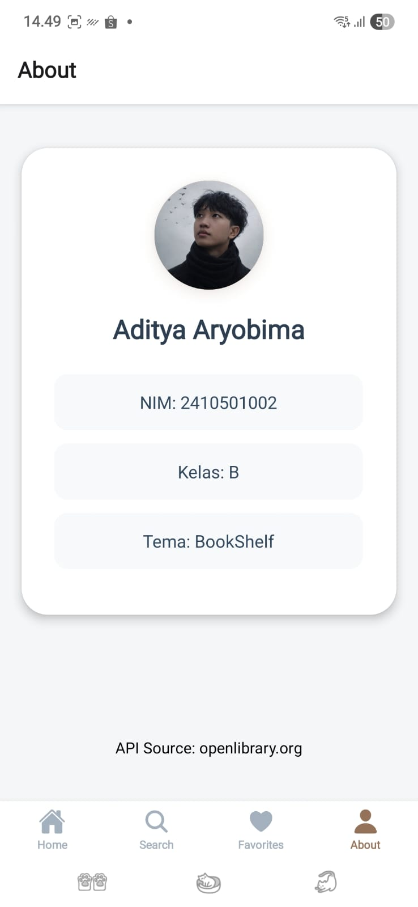
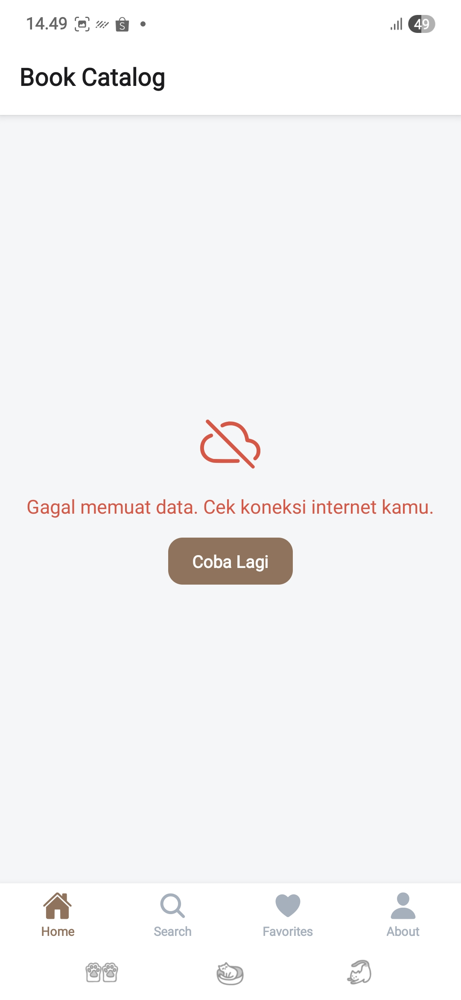

# BookShelf - Aplikasi Katalog Buku

# NAMA  : ADITYA ARYOBIMA
# NIM   : 2410501002
# KELAS : B
# Tema C

# Tech Stack & Versi
Berdasarkan `package.json`, aplikasi ini menggunakan:
- **Framework:** React Native(v0.81.5) + Expo SDK (~54.0.33)
- **Library Utama:** React (v19.1.0)
- **Navigation:** 
    - `@react-navigation/native` (v7.2.2) 
    - `@react-navigation/bottom-tabs` (v7.15.9)
    - `@react-navigation/native-stack` (v7.14.11)

- **Support Library:**
    - react-native-screens (~4.16.0)
    - react-native-safe-area-context (~5.6.0)

- **Icons:** `@expo/vector-icons` (Ionicons)
- **State Management:** Context API + useReducer
- **HTTP Client:** Native Fetch API

# Cara install & run
- **Clone Repositori:**
    - git clone https://github.com/adityaalig/uts-mobile-lanjut-2410501002-AdityaAryobima 
- **Masuk Direktori Proyek:**
    - cd uts_mobile_lanjut_bookshelf
- **Instalasi Dependensi:**
    - npm install
- **Jalankan Expo:**
    - npx expo start

# Screenshot Tampilan

 
 

# Link Video Demo
https://drive.google.com/file/d/1u8mR33KDtW7M3k4rpN0asyau2D1I3v0i/view?usp=sharing 

# State Management
Untuk mengelola data di aplikasi ini, saya menggunakan kombinasi api context dan useReducer. Alasannya, saya ingin pembagian tugas dalam kode ini menjadi lebih jelas. di sini Context API saya gunakan sebagai “jembatan” agar data, seperti daftar favorit, bisa diakses di berbagai layar tanpa perlu dikirim secara manual. Sementara itu, useReducer saya gunakan sebagai pusat kendali logika aplikasinya. Dengan begitu, pada bagian tampilan hanya berfokus untuk menampilkan data dan mengirim perintah saja, seperti menambah atau menghapus favorit. Jadi hasilnya, kode akan lebih rapi, mudah dikembangkan, dan lebih sederhana dalam proses pemeliharaan.

# Refleksi Pengerjaan
Dalam proses pengerjaan aplikasi BookShelf ini, saya mendapatkan banyak pengalaman dalam menggunakan React Native dan Expo. Tapi, tentunya juga ada tantangannya. Tantangan utama saya ada pada integrasi API OpenLibrary karena struktur datanya itu tidak konsisten, sehingga saya perlu menggunakan teknik double fetching untuk menampilkan data penulis. Selain itu, saya sempat mengalami error pada foto profil di AboutScreen akibat kesalahan relative path dan cache Expo, yang membuat saya menjadi lebih teliti dalam mengelola aset. Saya juga belajar mengelola state dengan lebih baikmenggunakan Context API dan useReducer. 

# Referensi
    - https://openlibrary.org/developers/api 
    - https://reactnavigation.org/docs/getting-started 

